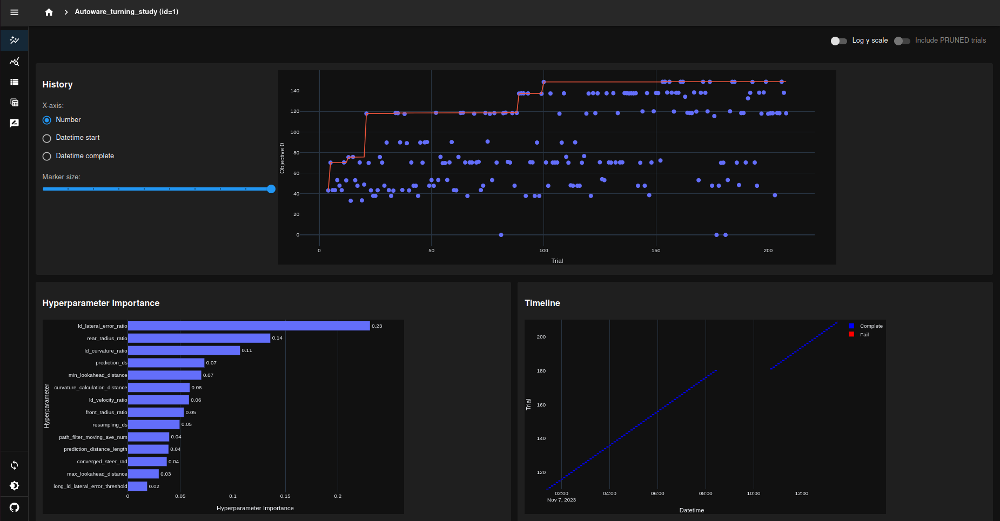

# Autoware-Autotune

alpha release


## Installation

1. Set up aichallenge repo with the following reference

  https://github.com/soyaoki/aichallenge2023-sim/blob/main/documentation/docfx_project/setup/index.md

2. Copy AWSIM-related executables such as `AWSIM.x86_64` under `/aichallenge2023-sim/docker/aichallenge/aichallenge_ws/AWSIM/`.

3. Clone this repository

```bash
cd ~/aichallenge2023-sim/docker/aichallenge/aichallenge_ws/
git clone https://github.com/soyaoki/Autoware-Autotune
```

4. Run the docker container

```bash
cd ~/aichallenge2023-sim/docker
sudo bash run_container.sh
```

5. Intstall requirements

```bash
pip install optuna optuna-dashboard
```

6. Edit target parameters in `target_param.yaml`.

7. Run `param_autotuner.py`.

```bash
cd /aichallenge/aichallenge_ws/Autoware-Autotune/
python3 param_autotuner.py 
```
(Optional) 8. Run dashboad on anothoer terminal

```bash
cd ./aichallenge2023-sim/docker
sudo bash run_container.sh
pip install optuna optuna-dashboard
cd /aichallenge/aichallenge_ws/Autoware-Autotune/
optuna-dashboard sqlite:///Autoware_turning_study.db
```

Then access "http://127.0.0.1:8080/". You can see the process of parameter optimization on Optuna dashboard.



## NOTE

・The default iteration is 50 iterations.　（TODO: Make it possible to pass the number of iterations as an argument.）

```python
study.optimize(lambda trial: objective(trial, param_ranges, param_files, target_param), n_trials=50)
```
・Comments in Autoware parameter files (e.g., obstacle_avoidance_planner.param.yaml) will disappear.

・一部治安が悪い
```python
# シャットダウン
# 現在のPythonプロセス以外のすべてのプロセスをキル
current_process = psutil.Process()
for process in psutil.process_iter(attrs=['pid', 'name']):
    if process.info['pid'] != current_process.pid:
        process.terminate()  # プロセスを終了させる
```
